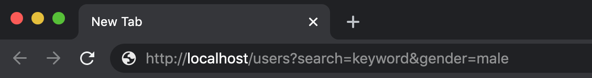

Saat membangun sebuah proyek aplikasi web, kita sering mendapati kebutuhan untuk menampilkan data berupa list.
Tak jarang pula, ketika ingin menampilkan list tersebut kita perlu melakukan filterisasi terlebih dahulu sebelum data di tampilkan.

Misalnya saja, ketika kita ingin melakukan filterisasi berupa pencarian data pengguna, dan dengan jenis kelamin laki - laki.
Pada umumnya kita akan menerapkan format request sebagai berikut

```noLineNumbers
http://localhost/users?search=keyword&gender=male
```

Kemudian kita dapat membuat implementasi dari filter tersebut pada controller seperti berikut

```:title=app/Http/Controllers/UserController.php
<?php

namespace App\Http\Controllers;

use App\User;
use Illuminate\Http\Request;

class UserController extends Controller
{
    public function index(Request $request)
    {
        $users = User::query();

        if ($request->filled('search')) {
            $users->where('name', 'LIKE', '%'.$request->search.'%');
        }

        if ($request->filled('gender')) {
            $users->where('gender', $request->gender);
        }

        return $users->get();
    }
}
```

Ketika mencoba menjalankan aplikasi, program yang kita buat dengan kode di atas sudah dapat menyelesaikan kebutuhan untuk melakukan filterisasi
sesuai dengan apa yang kita harapkan.

Akan tetapi jika di perhatikan, pada kode di atas kita melakukan pengecekan terhadap setiap filter yang di inginkan. Bayangkan bila aplikasi yang di buat
terus berkembang, dan kita memiliki kebutuhan untuk menambahkan beberapa filter dan atau dengan logic yang kompleks. Salah satu hal yang dapat di lakukan adalah menambahkan block code pengecekan-nya bukan?
Dan hal ini pula yang justru membuat program yang kita buat jadi kurang readable.

Nah untuk mensiasatinya, sebetulnya kita dapat memanfaatkan beberapa fitur yang disediakan oleh Laravel Framework dan juga bahasa pemrograman PHP itu sendiri.

#### 1. Membuat Base Class
Pada sebuah aplikasi, tentunya kita tidak hanya memiliki sebuah entitas saja. Dan setiap entitas akan dapat menerapkan filter nya masing - masing,
maka dari itu kita perlu membuat masing - masing class untuk implementasi filter yang kemudian akan meng-extends / menjadi turunan dari base class.

Oke, mari kita buat base class tersebut dengan nama `Filter` pada folder `app/Http/Filters`

```:title=app/Http/Filters/Filter.php
<?php

namespace App\Http\Filters;

use Illuminate\Database\Eloquent\Builder;
use Illuminate\Http\Request;
use Illuminate\Support\Str;

abstract class Filter
{
    /**
     * The request instance.
     *
     * @var \Illuminate\Http\Request
     */
    protected $request;

    /**
     * The builder instance.
     *
     * @var \Illuminate\Database\Eloquent\Builder
     */
    protected $builder;

    /**
     * Initialize a new filter instance.
     *
     * @param  \Illuminate\Http\Request  $request
     * @return void
     */
    public function __construct(Request $request)
    {
        $this->request = $request;
    }

    /**
     * Retrieve the request params.
     *
     * @return array
     */
    public function filters()
    {
        return collect($this->request->query())
            ->mapWithKeys(function($query, $key) {
                return [Str::camel($key) => $query];
            })
            ->all();
    }

    /**
     * Apply the filters on the builder.
     *
     * @param  \Illuminate\Database\Eloquent\Builder  $builder
     * @return \Illuminate\Database\Eloquent\Builder
     */
    public function apply(Builder $builder): Builder
    {
        $this->builder = $builder;

        foreach ($this->filters() as $name => $value) {
            if (method_exists($this, $name)) {
                call_user_func_array([$this, $name], array_filter([$value]));
            }
        }

        return $this->builder;
    }
}
```

Nah, sekarang kita sudah membuat sebuah abstract class dimana terdapat beberapa method di dalamnya. Yang pertama terdapat method dengan nama filters,
method ini berfungsi untuk mengumpulkan semua request params yang terdapat pada HTTP request, lalu di mapping ke dalam format camelCase,
sesuai dengan pedoman umum dalam penamaan sebuah method di dalam class pada bahasa pemrograman PHP.

Kemudian terdapat method dengan nama apply, method ini berfungsi untuk melakukan perulangan dan pengecekan terhadap filter yang kita butuhkan. Konsepnya, jika nama pada request params
memiliki nama yang sama dengan method yang terdapat pada base class atau turunannya, maka kita akan memanggil method tersebut serta melemparkan nilai filter sebagai method parameter.

#### 2. Mendefinisikan Filter
Sebagai contoh, mari kita buat class baru dengan nama `UserFilter.php` pada folder `app/Http/Filters`
```:title=app/Http/Filters/UserFilter.php
<?php

namespace App\Http\Filters;

use Illuminate\Database\Eloquent\Builder;

class UserFilter extends Filter
{
    /**
     * Filter the users by the given string.
     *
     * @param  string|null  $value
     * @return \Illuminate\Database\Eloquent\Builder
     */
    public function search(string $value = null): Builder
    {
        return $this->builder->where('name', 'like', "{$value}%");
    }

    /**
     * Filter the users by the given gender.
     *
     * @param  string|null  $value
     * @return \Illuminate\Database\Eloquent\Builder
     */
    public function gender(string $value = null): Builder
    {
        return $this->builder->where('gender', $value);
    }
}
```

Seperti yang sudah di jelaskan sebelumnya, ketika kita mendefinsikan sebuah method dengan nama sesuai dengan nama pada request params
maka kita otomatis membuat implementasi filter dengan memanfaatkan eloquent query builder.

Dan jika kita ingin menambahkan beberapa filter lagi, kita hanya perlu menambahkan method baru dengan nama method sesuai dengan nama request params yang akan dikirim.

#### 3. Implementasi Filter Pada Eloquent Model
Buatlah file dengan nama `Filterable.php` pada folder `app/Traits` berisikan Trait seperti berikut
```:title=app/Http/Filters/UserFilter.php
<?php

namespace App\Traits;

use App\Http\Filters\Filter;
use Illuminate\Database\Eloquent\Builder;

trait Filterable
{
    /**
     * Apply all relevant filters.
     *
     * @param  \Illuminate\Database\Eloquent\Builder  $query
     * @param  \App\Http\Filters\Filter  $filter
     * @return \Illuminate\Database\Eloquent\Builder
     */
    public function scopeFilter(Builder $query, Filter $filter): Builder
    {
        return $filter->apply($query);
    }
}
```

Kemudian pada file user model, kita dapat meng-import trait di atas untuk menggunakannya
```noLineNumbers
...
use App\Traits\Filterable;

class User extends Authenticatable
{
    use Notifiable, Filterable;

    ...
}
```

#### 4. Refactor File Controller
Terakhir, kita hanya perlu melakukan refactor pada kode yang terdapat pada Controller sehingga menjadi seperti ini :
```:title=app/Http/Controllers/UserController.php
<?php

namespace App\Http\Controllers;

use App\User;
use App\Http\Filters\UserFilter;

class UserController extends Controller
{
    public function index(UserFilter $filter)
    {
        $users = User::filter($filter);

        return $users->get();
    }
}
```

Sekarang coba perhatikan kode pada file controller di atas, jadi lebih sederhana dan mudah dibaca bukan? Lebih dari itu, kita juga dapat memanfaatkan filter tersebut dimanapun tanpa perlu mendefinsikannya berulang kali.

Menurut pendapat saya pribadi, teknik seperti ini sangat powerful untuk di terapkan. Kita bebas melakukan expresi filterisasi query pada eloquent model
berdasarkan HTTP request params. Secara implisit kita juga melakukan decoupling pada aplikasi yang kita buat dengan memisahkan baris kode untuk proses filterisasi.

Sekian untuk tulisan kali ini, semoga bermanfaat dan terima kasih.