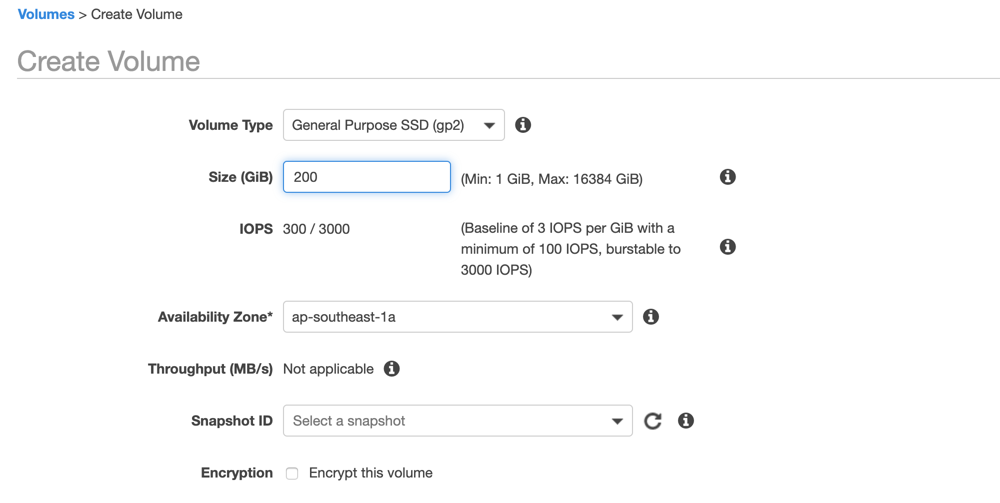
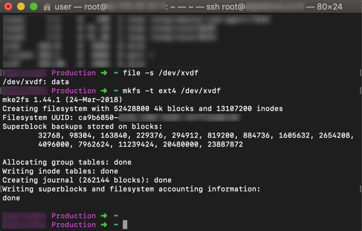

Terkadang saat membuat instance untuk layanan EC2 dari AWS, kita belum dapat memastikan seberapa besar alokasi storage (EBS Volume) yang akan kita gunakan. Oleh karenanya, tak jarang kita perlu mengurangi ukuran atau kapasitas dari EBS Volume, saat dirasa alokasi yang kita tentukan di awal belum sesuai.

Jika diperhatikan, ketika kita mencoba untuk melakukan pengurangan pada EBS Volume langsung melalui halaman AWS Console, akan muncul pesan error sebagai berikut:

Yap! Kita tidak dapat mengurangi kapasitas Volume secara langsung. Berbeda dengan saat ingin melakukan penambahan pada Volume, pesan error yang muncul menerangkan bahwa kita tidak diizinkan untuk melakukan pengurangan.

Untuk dapat mengurangi kapasitas dari Volume, saya menemukan beberapa trik yang bisa dilakukan tanpa harus membuat ulang instance EC2 yang sudah ada. Sebelum memulai tutorial ini, asumsikan bahwa kita memiliki Volume dari instance EC2 yang terinstal operasi sistem Ubuntu dengan kapasitas Volume sebesar **500GB** dan kita akan mengurangi kapasitasnya menjadi **200GB**.

Berikut adalah uraian dari strategi yang akan dilakukan:
##### Membuat Snapshot dari Volume
Untuk mencegah hal yang tidak diinginkan pada data yang terdapat pada Volume. Ketika ingin melakukan perubahan pada Volume, akan sangat bijak bila kita melakukan Snapshot pada Volume tersebut terlebih dahulu untuk mengamankan data.

##### Membuat Volume baru
Sebelum membuat Volume baru, pastikan terlebih dahulu instance EC2 yang kita gunakan sudah dalam keadaan shutdown. Jika sudah, buka halaman Elastic Block Store Volumes dan buatlah Volume baru sesuai dengan kebutuhan yang diperlukan, pada contoh kasus kali ini kita akan mengatur ukurannya menjadi 200GB.

##### Attach Volume baru ke Instance EC2
Agar Volume baru kita bisa di akses pada instance EC2, kita perlu meng-attach volume baru tersebut. Caranya cukup dengan klik kanan pada Volume lalu pilih Attach Volume, kemudian pilihlah instance EC2 yang akan diubah volumenya.

##### Memformat Volume baru

1. Nyalakan instance EC2, lalu masuk melalui SSH sebagai user root.
2. Untuk memeriksa ketersediaan dari volume, kita dapat menggunakan perintah  `file -s /dev/xvdf`
3. Untuk memformat Volume baru, gunakan perintah  `mkfs -t ext4 /dev/xvdf`

##### Mount Volume baru
1. Buat folder baru dengan menggunakan perintah `mkdir /mnt/new-volume`
2. Kemudian jalankan perintah `mount /dev/xvdf /mnt/new-volume`
3. Untuk memeriksa keberhasilan dari proses sebelumnya, jalankan perintah `df -h`

##### Salin data pada Volume lama ke Volume baru
1. Manfaatkan fitur pada perintah `rsync` untuk menyalin semua data yang ada pada volume lama ke volume baru. Caranya cukup dengan jalankan perintah `rsync -axv / /mnt/new-volume/`
2. Proses penyalinan data mungkin akan membutuhkan waktu cukup lama, tunggu hingga semua data berhasil di salin.

##### Menyiapkan Volume baru
1. Lakukan instalasi grup pada volume menggunakan perintah `grub-install --root-directory=/mnt/new-volume/ --force /dev/xvdf`
2. Unmount volume dengan perintah `umount /mnt/new-volume`
3. Periksa UUID pada volume lama, dengan perintah `blkid` Kemudian copy dan simpan UUID tersebut.
4. Perbarui UUID pada volume baru dengan perintah `tune2fs -U UUID_VOLUME_LAMA /dev/xvdf` Ubah bagian UUID sesuai dengan volume lama.
5. Kemudian, update juga label pada volume baru dengan perintah `e2label /dev/xvdf cloudimg-rootfs`

##### Ubah Volume untuk Instance EC2
1. Kita bisa keluar dari SSH, lalu matikan instance EC2.
2. Buka halaman AWS Console, masuk ke menu volumes, kemudian klik kanan pada volume lama dan juga volume baru, pilih opsi detach.
3. Masih di halaman yang sama, pilih volume baru kemudian attach volume baru ke instance EC2 dan isikan `/dev/sda1` pada field device.

Setelah semua langkah sudah dilakukan, kita bisa menyalakan instance EC2 kembali. Dan kini instance EC2 yang ada sudah berjalan menggunakan EBS Volume yang baru kita buat.

> #### Sebagai catatan
> Pastikan semua yang ada pada instance EC2 berjalan sebagaimana mestinya, sebelum memutuskan menghapus EBS Volume lama dan juga Snapshotnya.
> Saya pribadi membiarkannya hingga sekitar satu bulan, dan kemudian baru memutuskan untuk menghapus keduanya.
> ##### _Referensi_
> [Decrease the size of EBS volume in your EC2 instance](https://medium.com/@m.yunan.helmy/decrease-the-size-of-ebs-volume-in-your-ec2-instance-ea326e951bce "Decrease the size of EBS volume in your EC2 instance")